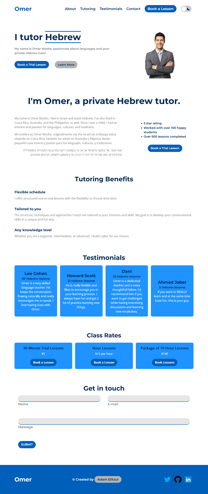

# Future Business Leaders of America club - Website Design project

This is my submission to the FBLA website design project.

## Table of contents

- [Overview](#overview)
  - [The challenge](#the-challenge)
  - [Screenshot](#screenshot)
  - [Links](#links)
- [My process](#my-process)
  - [Built with](#built-with)
  - [What I learned](#what-i-learned)
  - [Useful resources](#useful-resources)
- [Author](#author)

## Overview

### The challenge

Develop a website for a local business. This business can be real or fictional,
but must serve the members of your community. The website should include
the following elements:

- Header with logo
- Favicon
- Call to action button
- Form to subscribe to receive announcements
- Navigation menu
- Footer to include credits to website creators and copyright information

### Screenshot

### Links

- Solution URL: [Github](https://github.com/AdamElitzur/Language-Tutor-Portfolio)
- Live Site URL: [Omer Moses](https://omer-language-tutor-portfolio.vercel.app/)

## My process

### Built with

- HTML
- CSS
- Flexbox
- CSS Grid
- Mobile-first development
- Javascript

### What I learned

This was the first project that I built with a dark mode toggle. In order to do that I had to build the CSS with colors from CSS variables, instead of hard coding the colors. I learned a lot more about CSS from this because I followed a blog about the dark mode toggle (see below), but changed the design of the toggle.

### Useful resources

- [Dark Mode Blog Post](https://dev.to/ananyaneogi/create-a-dark-light-mode-switch-with-css-variables-34l8) - This helped me learn about making a dark mode toggle. I will continue using this strategy.

## Author

- Website - [Adam Elitzur](https://www.adamelitzur.com)
- LinkedIn - [Adam Elitzur](https://www.linkedin.com/in/adam-elitzur/)
- Twitter - [@adamcandoit](https://twitter.com/adamcandoit)
